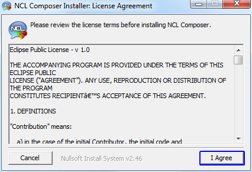
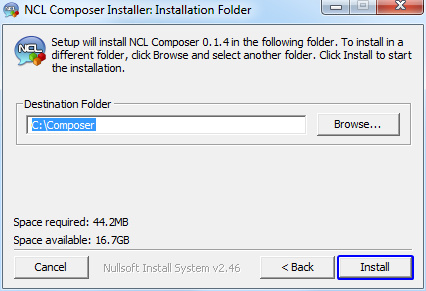
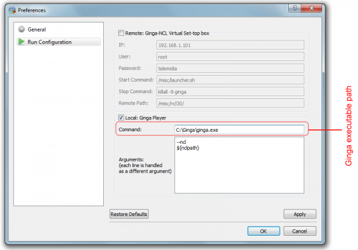
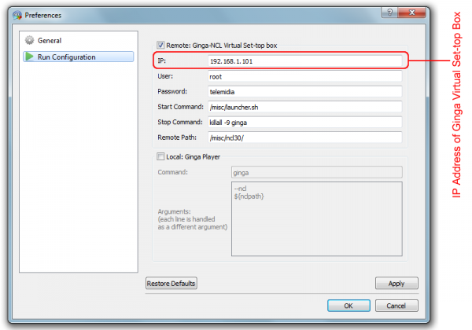
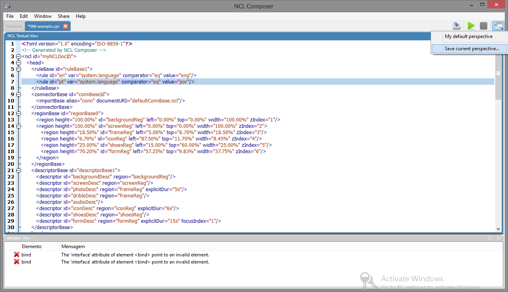

# Iniciando #
## Instalando o {nclcomposer} ##
### Windows ###

Para instalar o {nclcomposer} em ambiente Windows:

  * Baixe a versão mais atual do {nclcomposer} para Windows em:
    [http://composer.telemidia.puc-rio.br/en/download](http://composer.telemidia.puc-rio.br/en/download)

  * O arquivo deve ter o nome na forma _nclcomposer-installer-X.X.X.exe_, onde
    _X.X.X_ deve conter a versão do {nclcomposer}. Execute esse arquivo.

  * Caso você tenha alguma versão anterior instalada, o instalador irá
    perguntar se deseja desinstalá-la antes de prosseguir.

  * Caso contrário, a seguinte tela será exibida:

  * Clique no botão _I Agree_ para aceitar a licença do {nclcomposer}.
  * Após aceitar a licença do software, será possível escolher quais _plugins_
    serão instalados na sua máquina, por meio da tela (em caso de dúvida não
    altere):

  * Clique no botão _Next_, e será possível escolher o local onde o
	{nclcomposer} será instalado:

  * Por fim, o {nclcomposer} será instalado, e a seguinte tela exibida:
  

  * Caso não tenha ocorrido nenhum problema, feche o instalador. Será possível 
    executar o {nclcomposer} através do menu _Iniciar->{nclcomposer}->NCL 
    Composer_.

### Linux (Ubuntu/Debian) ###

Para instalar o {nclcomposer} em ambiente Linux (Ubuntu/Debian):

  * Baixe a versão mais atual do {nclcomposer} para Linux (Ubuntu/Debian) em:
    http://composer.telemidia.puc-rio.br/en/downloads
  * O arquivo deve ter o nome na forma _composer_X.X.X_i386.deb_, onde
    X.X.X deve conter a versão do {nclcomposer}. Para instalar o arquivo que foi
    baixado, execute o seguinte comando na linha de comando:

    > $ dpkg -i nclcomposer-X.X.X.deb

  * Caso a instalação ocorra sem problemas, é possível acessar o
    {nclcomposer} através do menu de aplicações, ou por meio do comando:

	> $ composer

### MacOS X ###

TODO
<!--
// Instalando um player NCL
// ~~~~~~~~~~~~~~~~~~~~~~~~
// O {nclcomposer}, por _default_, não vem com um _player_ NCL embutido. Dessa
// forma, para executar suas aplicações, será necessário que você tenha algum
// player NCL instalado.
// 
// É recomendado o uso da Implementação de Referência do
// http://www.ginga.org.br[Ginga-NCL]. As subseções a seguir detalham como
// instalar a Implementação de Referência do Ginga-NCL nos principais sistemas
// operacionais.
// 
// Implementação de Referência do Ginga-NCL
// ^^^^^^^^^^^^^^^^^^^^^^^^^^^^^^^^^^^^^^^^
// .Windows
// [NOTE]
// ========
// Para instalar o _Ginga4Windows_ (versão da implementação de referência do
// Ginga-NCL para a plataforma Windows):
// 
//  . Baixe a versão mais atual do _Ginga4Windows_ em:
// 	http://www.gingancl.org.br/en/ferramentas.
// 	. O arquivo deve ter o nome da forma _ginga-v.X.X.X-win32.exe_, onde _X.X.X_
// 	informa a versão mais atual. Execute esse arquivo e a seguinte tela deve
// 	aparecer:
// 
// 	TODO: Image.
// 
// 	. Caso a máquina na qual está instalando, não tenha as dependências
// 	necessárias o instalador irá automaticamente baixá-las da Internet.
// 
// Possíveis problemas::
// TODO
// ========
// 
// .Linux
// [NOTE]
// ======
// Até o momento da escrita deste manual ainda não existe um instalador da
// Implementação de Referência para a plataforma Linux. Sendo assim, caso deseje
// instalá-lo em uma máquina com sistema operacional Linux será necessário
// baixar e compilar o código-fonte.
// 
// Mais informações podem ser encontradas em:
// http://svn.softwarepublico.gov.br/trac/ginga/wiki/Building_Wiki_GingaNCL.
// ======
// 
// .MacOS X
// [NOTE]
// ========
// Até o momento da escrita deste manual ainda não existe um instalador da
// Implementação de Referência para a plataforma MacOS X. Sendo assim, caso
// deseje instalá-lo em uma máquina com sistema operacional MacOS X será
// necessário baixar e compilar o código-fonte.
// 
// Mais informações podem ser encontradas em:
// http://svn.softwarepublico.gov.br/trac/ginga/wiki/Building_Wiki_GingaNCL.
// ========
// 
// Ginga-NCL Virtual Set-top box
// ^^^^^^^^^^^^^^^^^^^^^^^^^^^^^
// .Windows
// [NOTE]
// ========
// TODO
// ========
// 
// .Linux (Ubuntu/Debian)
// [NOTE]
// ========
// TODO
// ========
// 
// .MacOS X
-->

## Configuração do Ambiente ##
### Integração com o player NCL ###

O {nclcomposer}, por _default_, não vem com um _player_ NCL embutido. Dessa
forma, para executar suas aplicações, será necessário que você tenha algum
player NCL instalado.

  > É recomendado o uso da [Implementação de Referência do
  > Ginga-NCL](http://www.ginga.org.br).

Existem duas formas principais de executar sua aplicação NCL a partir da
interface do {nclcomposer}:

 * No executável do Ginga-NCL instalado localmente; ou
 * em uma máquina remota (e.g. Ginga Virtual Set-top Box);

### Executando no Ginga-NCL localmente ###
Para configurar o {nclcomposer} para executar em uma instalação local do Ginga
selecione o Menu: _Edit->Preferences->Run Configuration_.

Nessa janela, marque a opção _Local: Ginga Player_ e na caixa de texto
_Command_ coloque o caminho completo do executável Ginga-NCL.

A caixa de texto _Argument_ pode ser preenchida com os parâmetros que o
executável do Ginga-NCL será chamado. Deve-se colocar um parâmetro em cada
uma das linhas.

### Executando no Ginga-NCL Virtual Set-top Box ###
Para executar no Ginga Virtual Set-top Box escolha a opção: _Remote: Ginga-NCL
Virtual Set-top Box_, conforme a figura a seguir:

Usualmente, o único parâmetro a ser modificado é o endereço IP da máquina
virtual contendo o _Ginga-NCL Virtual Set-top Box_. Só é sugerido modificar os
outros parâmetros caso você saiba exatamente o que está fazendo.

## Configurando a disposição das visões ##

### Escondendo/exibindo visões ###
É possível esconder ou mostrar cada uma das visões instaladas no {nclcomposer}
por meio do menu _Window->Views_:

### Criando novas perspectivas ###

É possível organizar as diversas visões na tela clicando na barra de
título de cada visão, e arastando-a para dispô-la da melhor forma que lhe 
convier na tela. Depois de organizá-las, é possível salvar uma determinada
organização de plug-ins na tela uma *perspectiva*, de tal forma, que seja 
simples voltar àquela organização quando necessário.

Para salvar a disposição atual de _Visões_ como uma nova perspectiva, é
suficiente ir no menu _Windows->Perspectives->Save current perspective..._.
Outra alternativa é clicar no ícone _Change your current perspective_ na barra
de tarefas e depois em _Save current perspective..._:

Idependente de pelo menu _Windows_ ou pela barra de tarefas, após a seleção da
opção _Save current perspective..._ o {nclcomposer}, irá solicitar o nome da
nova perspectiva (permitindo também marcá-la como a perspectiva padrão) através 
da janela a seguir:

### Alternando entre perspectivas ###

