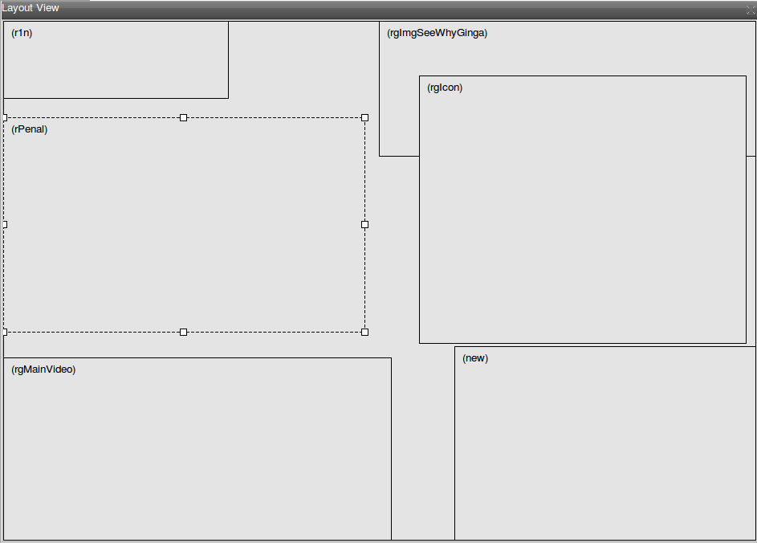
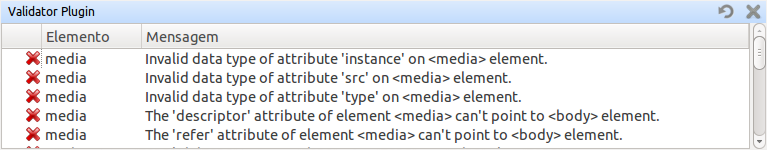

# Janelas e Menus do {nclcomposer} #

## Conceitos Básicos ##

### Plugins ###
_Plugins_ são pedaços de software que podem ser distribuídos separadamente e
adicionar ou modificar funcionalidades de um determinado software _host_.
Uma lista completa dos _plugins_ disponíveis oficialmente no site do
{nclcomposer}, pode ser encontrada em:
http://composer.telemidia.puc-rio.br/en/plugins/[].

### Visões ###
O tipo de _plugin_ mais comum do {nclcomposer} é aquele que denominamos
_Visão_. Uma visão é um _plugin_ que possui uma representação na interface
gráfica e permite ao autor visualizar/editar uma característica específica do
documento NCL.

As principais visões do {nclcomposer} são: {default_views}.

.Perspectivas
Uma _perspectiva_, no {nclcomposer}, é a disposição das visões na tela. É
permitido ao usuário criar suas próprias perspectivas, escolhendo a que melhor
o ajuda a efetuar uma determinada tarefa.

## Janela Principal ##

### Barra de título ###
Evidencia o nome do {nclcomposer} e do projeto corrente.

### Barra de menu ###
Mostra as entradas de menu disponíveis.

### Barra de ferramentas ###
As ações globais ficam disponíveis na barra de ferramentas. Por exemplo, as
açoes para salvar o projeto atual, executá-lo etc.

### Tab Bar ###
Lista a tela de boas-vindas e a lista de projetos abertos, permitindo navegar
entre eles.

### Área das Visões ###
Área de desenho das diversas <<def:views, Visões>>. Cada visão pode ter
seus próprios elementos de interface. Também é possível organizar e salvar a
disposição das diversas visões por meio das <<def:perspective, Perspectivas>>.

## Visões _Default_ ##

Por padrão o {nclcomposer} vem com as seguintes visões:

### {structural_view} ###

A {structural_view} permite que os autores de aplicações interajam visualmente
com a estrutura lógica do documento NCL. Em NCL, a estrutura lógica é
representada pelos seus objetos (nós de conteúdo e nós de composição) e os
elos entre esses objetos (representadas pelos elementos <link>).

### {layout_view} ###

A {layout_view} permite que os autores de aplicações NCL interajam visualmente
com as regiões onde os objetos de mídia serão inicialmente apresentados. Nesta
visão, os autores podem criar e manipular as regiões e a hierarquia de regiões
do documento.

### {outline_view} ###

A {outline_view} apresenta a estrutura do documento NCL como uma árvore,
permitindo aos autores navegarem no documento.

### {properties_view} ###

A {properties_view} apresenta o conjunto de propriedades da entidade
selecionada. Essa entidade selecionada por ser, por exemplo, uma região na
{layout_view}, um objeto de mídia na {structural_view} etc.

### {textual_view} ###

A _{textual_view}__ permite aos usuários interagirem diretamente com o
código-fonte da aplicação NCL. Ela é um editor de texto avançado focado na
linguagem NCL e traz funcionalidades como: coloração sintática, sugestão de
código contextual e formatação de código.

A _{textual_view}_ é recomendada especialmente para usuários avançados e que se
sentem à vontade com a sintaxe XML.

### {rules_view} ###

TODO

### {validator} ###

O validador é responsável por notificar erros e alertas no documento NCL.
A figura a seguir apresenta um exemplo.

