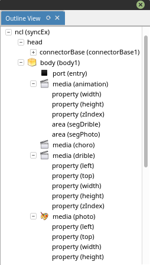
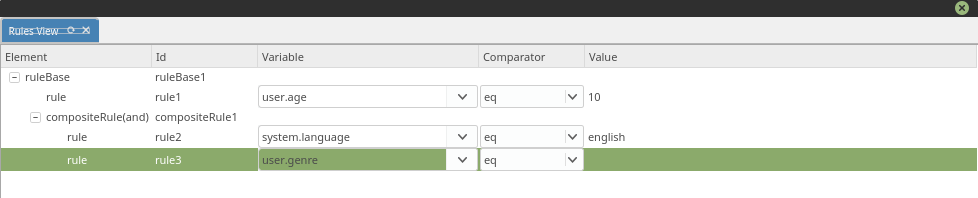

.. include:: dict.rst

Telas e Menus do |nclcomposer|
==============================

Janela Principal
----------------

.. figure:: ../img/main-window-details.png
   :align: center
   :alt: 

Barra de título
~~~~~~~~~~~~~~~

Evidencia o nome do |nclcomposer| e do projeto corrente.

Barra de projetos
~~~~~~~~~~~~~~~~~

Lista a tela de boas-vindas e a lista de projetos abertos, permitindo
navegar entre eles.

Área das Visões
~~~~~~~~~~~~~~~

Área de desenho das diversas visões. Cada visão pode ter seus próprios
elementos de interface. Também é possível organizar e salvar a
disposição das diversas visões por meio das perspectivas.

Barra de perspectivas
~~~~~~~~~~~~~~~~~~~~~

Apresenta as perspectivas salvas pelo usuário e permite facilmente
alternar entre elas.

Barra de menus
~~~~~~~~~~~~~~

Mostra as entradas de menu disponíveis.

.. |menu_file_img| image:: ../img/main-window-menu-file.png
.. |menu_edit_img| image:: ../img/main-window-menu-edit.png
.. |menu_view_img| image:: ../img/main-window-menu-view.png
.. |menu_share_img| image:: ../img/main-window-menu-share.png
.. |menu_help_img| image:: ../img/main-window-menu-help.png

+----------------------------+------------------+
| Menu                       | Screnshot        |
+============================+==================+
| **File**: Da acesso às     | |menu_file_img|  |
| seguintes opções:          |                  |
|                            |                  |
| -  Novo projeto            |                  |
| -  Abrir                   |                  |
| -  Salvar                  |                  |
+----------------------------+------------------+
| **Edit**:                  | |menu_edit_img|  |
+----------------------------+------------------+
| **View**:                  | |menu_view_img|  |
+----------------------------+------------------+
| **Share**:                 | |menu_share_img| |
+----------------------------+------------------+
| **Help**:                  | |menu_share_img| |
+----------------------------+------------------+

Atalhos
~~~~~~~

Os atalhos globais (válidos em qualquer visão) do |nclcomposer| são:

-  **``Ctrl``\ +\ ``n``** - **Novo projeto**.
-  **``Ctrl``\ +\ ``o``** - **Abrir projeto**.
-  **``Ctrl``\ +\ ``s``** - **Salvar o projeto corrente**.
-  **``Ctrl``\ +\ ``Shift``\ +\ ``s``** - **Salvar todos os projetos
   abertos**.
-  **``Ctrl``\ +\ ``Alt``\ +\ ``s``** - **Salvar como...**: Salva o
   projeto corrente com outro nome.
-  **``Ctrl``\ +\ ``F4``** - **Fechar projeto**.
-  **``Alt+F4``** ou **``Ctrl``\ +\ ``Q``** - **Fechar o
   |nclcomposer|**.
-  **``F11``** - **Habilita/desabilita visualização em tela cheia**.
-  **``F1``** - **Abre a ajuda do |nclcomposer|**.
-  **``F5``** - **Atualiza o modelo da visão com foco**.
-  **``Ctrl``\ +\ ``1``, ``Ctrl``\ +\ ``2``, ...** - **Alterna entre as
   perspectivas**.

|structural_view|
------------------

A |structural_view| permite que os autores de aplicações interajam
visualmente com a estrutura lógica do documento NCL. Em NCL, a estrutura
lógica é representada pelos seus objetos (nós de conteúdo e nós de
composição) e os elos entre esses objetos (representadas pelos elementos
).

.. figure:: ../img/plugin-structural.png
   :align: center
   :alt: |structural_view|

Ações
~~~~~

As ações são as diversas atividades que o usuário pode realizar durante
o processo de autoria. Uma ação pode ser executada de várias formas:
através da barra de ferramenta, do menu contextual, de um atalho de
teclado, do *mouse* e da combinação de várias dessas formas. Abaixo são
descritas cada uma das ações disponíveis na |structural_view| e como
elas podem ser executadas.

+--------------+---------------------------------+-----------------------------+
| Ação         | Descrição                       |                             |
+==============+=================================+=============================+
| Desfazer     | Desfaz a última ação realizada  | Esta ação pode ser          |
|              | na visão. Esta ação é ignorada  | executada através da:       |
|              | caso não exista nenhuma ação    | `barra de                   |
|              | para ser defeita. *Inserir*,    | ferramentas <#barra-de-ferr |
|              | *remover*, *mover* e            | amentas>`__                 |
|              | *redimencionar* são exemplos de | (#barra-de-ferramentas),    |
|              | ações que podem ser desfeitas.  | `menu                       |
|              | Por outro lado, selecionar não  | contextual <#menus>`__ e    |
|              | é uma ação que pode ser         | `atalho <#atalhos>`__.      |
|              | desfeita. Na versão atual, não  |                             |
|              | existe um limite na quantidade  |                             |
|              | de ações que podem ser          |                             |
|              | desfeitas.                      |                             |
+--------------+---------------------------------+-----------------------------+
| Refazer      | Refaz a última ação realizada   | Esta ação pode ser          |
|              | na visão. Esta ação é ignorada  | executada através da:       |
|              | caso não exista nenhuma ação    | `barra de                   |
|              | para ser refeita, ou seja,      | ferramentas <#barra-de-ferr |
|              | nenhuma ação foi desfeita       | amentas>`__                 |
|              | anteriormente. Na versão atual, | (#barra-de-ferramentas),    |
|              | não existe um limite na         | `menu                       |
|              | quantidade de ações que podem   | contextual <#menus>`__ e    |
|              | ser desfeitas.                  | `atalho <#atalhos>`__.      |
+--------------+---------------------------------+-----------------------------+
| Recortar     | Copia a entidade selecionada    | Esta ação pode ser          |
|              | para a **área de                | executada através da:       |
|              | trânsferencia** e **remove**    | `barra de                   |
|              | ela da visão. Esta ação é       | ferramentas <#barra-de-ferr |
|              | ignorada caso nenhuma entidade  | amentas>`__                 |
|              | tenha sido selecionada e se a   | (#barra-de-ferramentas),    |
|              | entidade selecionada é do tipo  | `menu                       |
|              | *body*.                         | contextual <#menus>`__ e    |
|              |                                 | `atalho <#atalhos>`__.      |
+--------------+---------------------------------+-----------------------------+
| Copiar       | Copia a entidade selecionada    | Esta ação pode ser          |
|              | para a **área de                | executada através da:       |
|              | trânsferencia**. Esta ação é    | `barra de                   |
|              | ignorada caso nenhuma entidade  | ferramentas <#barra-de-ferr |
|              | tenha sido selecionada e se a   | amentas>`__                 |
|              | entidade selecionada é do tipo  | (#barra-de-ferramentas),    |
|              | *body*.                         | `menu                       |
|              |                                 | contextual <#menus>`__ e    |
|              |                                 | `atalho <#atalhos>`__.      |
+--------------+---------------------------------+-----------------------------+
| Colar        | Adiciona a entidade copiada     | Esta ação pode ser          |
|              | para *área de trânsferencia*    | executada através da:       |
|              | como filha da entidade          | `barra de                   |
|              | selecionada. Esta ação é        | ferramentas <#barra-de-ferr |
|              | ignorada caso nenhuma entidade  | amentas>`__                 |
|              | tenha sido recortada ou copiada | (#barra-de-ferramentas),    |
|              | e se a entidade selecionada não | `menu                       |
|              | permita que seja adicionado     | contextual <#menus>`__ e    |
|              | como um de seus filhos          | `atalho <#atalhos>`__.      |
|              | entidades do tipo selecionada.  |                             |
|              | Por exemplo, não é possível     |                             |
|              | colar um contexto em uma mídia. |                             |
+--------------+---------------------------------+-----------------------------+
| Deletar      | Remove a entidade selecionada   | Esta ação pode ser          |
|              | da visão. Esta ação é ignorada  | executada através do: `menu |
|              | caso nenhuma entidade esteja    | contextual <#menus>`__ e    |
|              | selecionada na visão.           | `atalho <#atalhos>`__.      |
+--------------+---------------------------------+-----------------------------+
| Mover        | Move a entidade selecionada     | Esta ação pode ser          |
|              | para uma entidade de destino.   | executada através de        |
|              | Para a structural\_view, mover  | `atalho <#atalhos>`__.      |
|              | significa alterar o parêntesco  |                             |
|              | da entidade selecionada. A      |                             |
|              | entidade de destino é           |                             |
|              | determinada manipulando a       |                             |
|              | entidade selecionada por meio   |                             |
|              | de *drag-n-drop* para o         |                             |
|              | interior da entidade de         |                             |
|              | destino. Esta ação é ignorada   |                             |
|              | caso a entidade de destino não  |                             |
|              | permita que seja adicionado     |                             |
|              | como um de seus filhos          |                             |
|              | entidades do tipo selecionado.  |                             |
+--------------+---------------------------------+-----------------------------+
| Aumentar     | Aumenta o *zoom* na visão. Esta | Esta ação pode ser          |
| Zoom         | ação é ignorada caso a visão    | executada através da:       |
|              | tenha alcançado seu *zoom*      | `barra de                   |
|              | máximo.                         | ferramentas <#barra-de-ferr |
|              |                                 | amentas>`__                 |
|              |                                 | (#barra-de-ferramentas) e   |
|              |                                 | `atalho <#atalhos>`__.      |
+--------------+---------------------------------+-----------------------------+
| Diminuir     | Diminue o *zoom* na visão. Esta | Esta ação pode ser          |
| Zoom         | ação é ignorada caso a visão    | executada através da:       |
|              | tenha alcançado seu *zoom*      | `barra de                   |
|              | mínimo.                         | ferramentas <#barra-de-ferr |
|              |                                 | amentas>`__                 |
|              |                                 | (#barra-de-ferramentas) e   |
|              |                                 | `atalho <#atalhos>`__.      |
+--------------+---------------------------------+-----------------------------+
| Tirar uma    | Exporta o projeto como imagem   | Esta ação pode ser          |
| Foto         | (.png). O projeto pode ser      | executada através da:       |
|              | exportado mesmo que nenhuma     | `barra de                   |
|              | entidade tenha sido adicionada. | ferramentas <#barra-de-ferr |
|              |                                 | amentas>`__                 |
|              |                                 | (#barra-de-ferramentas) e   |
|              |                                 | `menu                       |
|              |                                 | contextual <#menus>`__.     |
+--------------+---------------------------------+-----------------------------+
| Habilitar    | Altera o modo de edição da      | Esta ação pode ser          |
| Ferramenta   | structural\_view para           | executada através da:       |
| de Ponteiro  | "ponteiro". Quando no modo de   | `barra de                   |
|              | "ponteiro", a structural\_view  | ferramentas <#barra-de-ferr |
|              | permite selecionar, mover e     | amentas>`__                 |
|              | redimencionar as entidades da   | (#barra-de-ferramentas) e   |
|              | através do *mouse*. O modo de   | `atalho <#atalhos>`__.      |
|              | "ponteiro" é desabilitado       |                             |
|              | sempre o modo de *"link"* é     |                             |
|              | habilitado.                     |                             |
+--------------+---------------------------------+-----------------------------+
| Habilitar    | Altera o modo de edição da      | Esta ação pode ser          |
| Ferramenta   | structural\_view para *"link"*. | executada através da:       |
| de Link      | Quando no modo de *"link"*, a   | `barra de                   |
|              | structural\_view permite criar  | ferramentas <#barra-de-ferr |
|              | *links* (relacionamentos) entre | amentas>`__                 |
|              | duas entidades. Para criar um   | (#barra-de-ferramentas) e   |
|              | novo *link*, o usuário deve:    | `atalho <#atalhos>`__.      |
|              | **i)** clicar com o botão       |                             |
|              | esquerdo do *mouse* na entidade |                             |
|              | de origem, **ii)** arrastar o   |                             |
|              | *mouse* até a entidade de       |                             |
|              | destino e, em seguida, **iii)** |                             |
|              | soltar o botão esquerdo do      |                             |
|              | *mouse*. O modo de *"link"* é   |                             |
|              | desabilitado sempre o modo de   |                             |
|              | "ponteiro" é habilitado. Caso   |                             |
|              | seja permitido criar um         |                             |
|              | relaciomaneto entre as          |                             |
|              | entidades de origem e destino,  |                             |
|              | uma caixa de diálogo será       |                             |
|              | apresentada para finalizar o    |                             |
|              | processo de criação de *link*.  |                             |
|              | Caso contrário, a ação é        |                             |
|              | ignorada. Detalhes sobre o      |                             |
|              | `diálogo de criação <#links>`__ |                             |
|              | de *link* será discutido mais a |                             |
|              | frente.                         |                             |
+--------------+---------------------------------+-----------------------------+
| Criar uma    | Adiciona uma entidade do tipo   | Esta ação pode ser          |
| Mídia        | mídia como filha da entidade    | executada através da:       |
|              | selecionada. Esta ação é        | `barra de                   |
|              | ignorada caso a entidade        | ferramentas <#barra-de-ferr |
|              | selecionada não permita que     | amentas>`__                 |
|              | seja adicionada como um de seus | (#barra-de-ferramentas),    |
|              | filhos entidades do tipo mídia. | `menu                       |
|              |                                 | contextual <#menus>`__ e    |
|              |                                 | `atalho <#atalhos>`__.      |
+--------------+---------------------------------+-----------------------------+
| Criar uma    | Adiciona uma entidade do tipo   | Esta ação pode ser          |
| Contexto     | contexto como filha da entidade | executada através da:       |
|              | selecionada. Esta ação é        | `barra de                   |
|              | ignorada caso a entidade        | ferramentas <#barra-de-ferr |
|              | selecionada não permita que     | amentas>`__                 |
|              | seja adicionada como um de seus | (#barra-de-ferramentas),    |
|              | filhos entidades do tipo        | `menu                       |
|              | contexto.                       | contextual <#menus>`__ e    |
|              |                                 | `atalho <#atalhos>`__.      |
+--------------+---------------------------------+-----------------------------+
| Criar um     | Adiciona uma entidade do tipo   | Esta ação pode ser          |
| *Switch*     | *switch* como filha da entidade | executada através da:       |
|              | selecionada. Esta ação é        | `barra de                   |
|              | ignorada caso a entidade        | ferramentas <#barra-de-ferr |
|              | selecionada não permita que     | amentas>`__,                |
|              | seja adicionada como um de seus | `menu                       |
|              | filhos entidades do tipo        | contextual <#menus>`__ e    |
|              | *switch*.                       | `atalho <#atalhos>`__.      |
+--------------+---------------------------------+-----------------------------+
| Criar o      | Adiciona uma entidade do tipo   | Esta ação pode ser          |
| *Body*       | *body* na visão. Esta ação é    | executada através da:       |
|              | ignorada caso um *body* já      | `barra de                   |
|              | tenha sido adicionado           | ferramentas <#barra-de-ferr |
|              | previamente.                    | amentas>`__,                |
|              |                                 | `menu                       |
|              |                                 | contextual <#menus>`__ e    |
|              |                                 | `atalho <#atalhos>`__.      |
+--------------+---------------------------------+-----------------------------+
| Criar uma    | Adiciona uma entidade do tipo   | Esta ação pode ser          |
| Área         | área como filha da entidade     | executada através da:       |
|              | selecionada. Esta ação é        | `barra de                   |
|              | ignorada caso a entidade        | ferramentas <#barra-de-ferr |
|              | selecionada não permita que     | amentas>`__,                |
|              | seja adicionada como um de seus | `menu                       |
|              | filhos entidades do tipo área.  | contextual <#menus>`__ e    |
|              |                                 | `atalho <#atalhos>`__.      |
+--------------+---------------------------------+-----------------------------+
| Criar uma    | Adiciona uma entidade do tipo   | Esta ação pode ser          |
| Propriedade  | propriedade como filha da       | executada através da:       |
|              | entidade selecionada. Esta ação | `barra de                   |
|              | é ignorada caso a entidade      | ferramentas <#barra-de-ferr |
|              | selecionada não permita que     | amentas>`__,                |
|              | seja adicionada como um de seus | `menu                       |
|              | filhos entidades do tipo        | contextual <#menus>`__ e    |
|              | propriedade.                    | `atalho <#atalhos>`__.      |
+--------------+---------------------------------+-----------------------------+
| Criar uma    | Adiciona uma entidade do tipo   | Esta ação pode ser          |
| Porta        | porta como filha da entidade    | executada através da:       |
|              | selecionada. Esta ação é        | `barra de                   |
|              | ignorada caso a entidade        | ferramentas <#barra-de-ferr |
|              | selecionada não permita que     | amentas>`__,                |
|              | seja adicionada como um de seus | `menu                       |
|              | filhos entidades do tipo porta. | contextual <#menus>`__ e    |
|              |                                 | `atalho <#atalhos>`__.      |
+--------------+---------------------------------+-----------------------------+
| Criar uma    | Adiciona uma entidade do tipo   | Esta ação pode ser          |
| Porta de     | porta de *switch* como filha da | executada através da:       |
| *Switch*     | entidade selecionada. Esta ação | `barra de                   |
|              | é ignorada caso a entidade      | ferramentas <#barra-de-ferr |
|              | selecionada não permita que     | amentas>`__,                |
|              | seja adicionada como um de seus | `menu                       |
|              | filhos entidades do tipo porta  | contextual <#menus>`__ e    |
|              | de *switch*.                    | `atalho <#atalhos>`__.      |
+--------------+---------------------------------+-----------------------------+
| Habilitar/   | Habilita/Desabilita o minimapa. | Esta ação pode ser          |
| Desabilitar  | Quando habilitado, o minimapa é | executada através da:       |
| Minimapa     | exibido no canto inferior       | `barra de                   |
|              | direito da visão.               | ferramentas <#barra-de-ferr |
|              |                                 | amentas>`__                 |
|              |                                 | e `atalho <#atalhos>`__.    |
+--------------+---------------------------------+-----------------------------+

Barra de Ferramentas
~~~~~~~~~~~~~~~~~~~~

A partir da versão 0.3.0 a |structural_view| disponibiliza uma *barra
de ferramentas* com as principais ações da visão.

.. figure:: ../img/plugin-structural-toolbar-index.png
   :alt: |structural_view} - Barra de Ferramenta
   :align: center

A figura acima apresenta a *barra de ferramentas*, cujo detalhes de cada
ferramenta são descritos a seguir:

-  **(a) - Desfazer:** Desfaz a última ação realizada na visão. `Mais
   detalhes <#ações>`__.
-  **(b) - Refazer:** Refaz a última ação reallizada na visão. `Mais
   detalhes <#ações>`__.
-  **(c) - Recortar:** Copia a entidade selecionada para a **área de
   trânsferencia** e **remove** ela da visão. `Mais
   detalhes <#ações>`__.
-  **(d) - Copiar:** Copia a entidade selecionada para a **área de
   trânsferencia**. `Mais detalhes <#ações>`__.
-  **(e) - Colar:** Adiciona a entidade copiada para *área de
   trânsferencia* como filha da entidade selecionada. `Mais
   detalhes <#ações>`__.
-  **(f) - Aumentar o *Zoom:*** Aumenta o *Zoom* na visão. `Mais
   detalhes <#ações>`__.
-  **(g) - Diminuir o *Zoom:*** Diminue o *Zoom* na visão. `Mais
   detalhes <#ações>`__.
-  **(h) - Tirar uma Foto:** Exporta o projeto como imagem (.png). `Mais
   detalhes <#ações>`__.
-  **(i) - Ferramenta de Ponteiro:** Altera o modo de edição da visão
   para "ponteiro". `Mais detalhes <#ações>`__.
-  **(j) - Ferramenta de *Link*:** Altera o modo de edição da visão para
   "link". `Mais detalhes <#ações>`__.
-  **(k) - Adicionar Mídia:** Adiciona uma entidade do tipo mídia como
   filha da entidade selecionada. `Mais detalhes <#ações>`__.
-  **(l) - Adicionar Contexto:** Adiciona uma entidade do tipo context
   como filha da entidade selecionada. `Mais detalhes <#ações>`__.
-  **(m) - Adicionar *Switch*:** Adiciona uma entidade do tipo *switch*
   como filha da entidade selecionada. `Mais detalhes <#ações>`__.
-  **(n) - Adicionar *Body*:** Adiciona um *body* na visão. `Mais
   detalhes <#ações>`__.
-  **(o) - Adicionar Área:** Adiciona uma entidade do tipo área como
   filha da entidade selecionada. `Mais detalhes <#ações>`__.
-  **(p) - Adicionar Propriedade:** Adiciona uma entidade do tipo
   propriedade como filha da entidade selecionada. `Mais
   detalhes <#ações>`__.
-  **(q) - Adicionar Porta:** Adiciona uma entidade do tipo porta como
   filha da entidade selecionada. `Mais detalhes <#ações>`__.
-  **(r) - Adicionar Porta de *Switch*:** Adiciona uma entidade do tipo
   porta de *switch* como filha da entidade selecionada. `Mais
   detalhes <#ações>`__.

Menus
~~~~~

Menu Contextual
^^^^^^^^^^^^^^^

O menu contextual é exibido sempre que o usuário clica com o botão
direito do *mouse* em qualquer entidade ou nas áreas vazias (em branco)
da visão.

.. figure:: ../img/plugin-structural-menu-contextual-index.png
   :alt: |structural_view| - Menu Contextual

A figura acima apresenta o *menu contextual*, cujo detalhes são
descritos abaixo:

-  **(a) - Exibir Ajuda:** Exibe o diálogo de ajuda. **Desabilitado
   nesta versão**.
-  **(b) - Insert:** Exibe o submenu de adção de entidades.
-  **(c) - Desfazer:** Desfaz a última ação realizada na visão. `Mais
   detalhes <#ações>`__.
-  **(d) - Refazer:** Refaz a última ação reallizada na visão. `Mais
   detalhes <#ações>`__.
-  **(e) - Recortar:** Copia a entidade selecionada para a **área de
   trânsferencia** e **remove** ela da visão. `Mais
   detalhes <#ações>`__.
-  **(f) - Copiar:** Copia a entidade selecionada para a **área de
   trânsferencia**. `Mais detalhes <#ações>`__.
-  **(g) - Colar:** Adiciona a entidade copiada para *área de
   trânsferencia* como filha da entidade selecionada. `Mais
   detalhes <#ações>`__.
-  **(h) - Deletar:** Remove a entidade selecionada da visão. `Mais
   detalhes <#ações>`__.
-  **(i) - Tirar uma Foto:** Exporta o projeto como imagem (.png). `Mais
   detalhes <#ações>`__.
-  **(j) - Exibir Propriedades:** Exibe o diálogo de propriedades.
   **Desabilitado nesta versão**
-  **(k) - Adicionar Mídia:** Adiciona uma entidade do tipo mídia como
   filha da entidade selecionada. `Mais detalhes <#ações>`__.
-  **(l) - Adicionar Contexto:** Adiciona uma entidade do tipo context
   como filha da entidade selecionada. `Mais detalhes <#ações>`__.
-  **(m) - Adicionar *Switch*:** Adiciona uma entidade do tipo *switch*
   como filha da entidade selecionada. `Mais detalhes <#ações>`__.
-  **(n) - Adicionar *Body*:** Adiciona um *body* na visão. `Mais
   detalhes <#ações>`__.
-  **(o) - Adicionar Área:** Adiciona uma entidade do tipo área como
   filha da entidade selecionada. `Mais detalhes <#ações>`__.
-  **(p) - Adicionar Propriedade:** Adiciona uma entidade do tipo
   propriedade como filha da entidade selecionada. `Mais
   detalhes <#ações>`__.
-  **(q) - Adicionar Porta:** Adiciona uma entidade do tipo porta como
   filha da entidade selecionada. `Mais detalhes <#ações>`__.
-  **(r) - Adicionar Porta de *Switch*:** Adiciona uma entidade do tipo
   porta de *switch* como filha da entidade selecionada. `Mais
   detalhes <#ações>`__.

Diálogos
~~~~~~~~

Diálogo de Link
^^^^^^^^^^^^^^^

O diálogo de *link* é utilizado para criação e edição de: *links*,
*binds*, parâmetros de *link* e parâmetros de *binds*. O diálogo para
criação de *link* é exibido quando um relacionamento entre uma entidade
de origem e destino é especificado através da `ferramenta de criação de
*link* <#ações>`__.

Logo que exibido (figura abaixo), o diálogo de *link* apresenta uma
lista de conectores para que o usuário possa escolher. A lista de
conectores é carregada dinâmicamente a partir das especificações da
aplicação em desenvolvimento.

.. figure:: ../img/plugin-structural-dialog-create-link.png
   :alt: |structural_view| - Diálogo para Criação de elos

Assim que o usuário começar a preencher a caixa de texto *"connector"*
(figura abaixo), a lista de conectores é filtrada para facilitar a
seleção do conector apropriado.

.. figure:: ../img/plugin-structural-dialog-create-link-autocomplete.png
   :alt: |structural_view| - Diálogo para Criação de elos

Uma vez selecionado um dos conectores na lista, o usuário pode escolher
qual o tipo de condição e ação na seção de *binds* do diálogo (figura
abaixo). Os tipos de condições e ações disponíveis são carregados a
patir do conector selecionado.

Ainda na criação do *link*, quando o usuário habilita a exibição de
parâmetros (*"show params"*), é possível especificar os valores dos
parâmetros de *link*, parâmetros do *bind* de condição e parâmetros do
*bind* de ação (figura abaixo) que devem ser considerados para criação
do relacionamento.

.. figure:: ../img/plugin-structural-dialog-create-link-params.png
   :alt: |structural_view| - Diálogo para Criação de 'Links'

Para editar os parâmetros de um *link*, o usuário deve clicar duas vezes
na entidade do tipo *link* na visão. Esta ação resultana exibição do
diálogo abaixo.

.. figure:: ../img/plugin-structural-dialog-edit-link.png
   :alt: |structural_view| - Diálogo para Edição de 'Links'

De modo semelhante, para editar um *bind*, o usuário deve clicar duas
vezes na entidade do tipo *bind*, resultando na exibição do diálogo
abaixo.

.. figure:: ../img/plugin-structural-dialog-edit-bind-condition.png
   :alt: |structural_view| - Diálogo para Edição de 'Bind' (Condição)

Referência
^^^^^^^^^^

É possível especificar uma referência através da ação de
`colar <#ações>`__. Assim que a ação de colar é realizada o diálogo
abaixo é exibido, solicitando que o autor escolha entre copiar ou criar
uma referência da entidade copiada para *área de tranferência*.

.. figure:: ../img/plugin-structural-dialog-create-refer.png
   :alt: |structural_view| - Diálogo para Criação de Referência

Quando uma entidade é uma referência, ela fica levemente transparente
(figura abaixo) e herda todas as interfaces da entidade referenciada.
Não é possível referenciar uma entidade que já referencia uma outra.
Nesta versão ainda não é possível fazer referência para entidades do
tipo: contexto, *switch* e *body*.

.. figure:: ../img/plugin-structural-refer.png
   :alt: |structural_view| - Referência

Atalhos
~~~~~~~

Abaixo segue a lista de atalhos da |structural_view|:

-  **``Ctrl``\ +\ ``z``** - **Desfazer**: Desfaz a última ação realizada
   na visão. `Mais detalhes <#ações>`__.
-  **``Ctrl``\ +\ ``Shift``\ +\ ``z``** - **Refazer**: Refaz a última
   ação reallizada na visão. `Mais detalhes <#ações>`__.
-  **``Ctrl``\ +\ ``x``** - **Recortar**: Copia a entidade selecionada
   para a **área de trânsferencia** e **remove** ela da visão. `Mais
   detalhes <#ações>`__.
-  **``Ctrl``\ +\ ``c``** - **Copiar**: Copia a entidade selecionada
   para a **área de trânsferencia**. `Mais detalhes <#ações>`__.
-  **``Ctrl``\ +\ ``v``** - **Colar**: Adiciona a entidade da *área de
   trânsferencia* como filha da entidade selecionada. `Mais
   detalhes <#ações>`__.
-  **``Del``** - **Deletar**: Remove a entidade selecionada da visão.
   `Mais detalhes <#ações>`__.
-  ***Segurar* ``Ctrl``\ +\ *Drag-n-drop*** - Mover: Remove a entidade
   selecionada da visão. `Mais detalhes <#ações>`__.
-  **``Ctrl``\ +\ ``+``** ou **``Ctrl``\ +\ *Roda do mouse para cima***
   - **Aumentar o *zoom***: Aumenta o *zoom* na visão. `Mais
   detalhes <#ações>`__.
-  **``Ctrl``\ +\ ``-``** ou **``Ctrl``\ +\ *Roda do mouse para baixo***
   - **Diminuir o *zoom***: Diminue o *zoom* na visão. `Mais
   detalhes <#ações>`__.
-  **``1``** - **Habilitar Ferramenta de Ponteiro**: Altera o modo de
   edição da visão para "ponteiro". `Mais detalhes <#ações>`__.
-  **``2``** ou ***Segurar* ``Shift``** - Habilitar Ferramenta de
   *Link*: Altera o modo de edição da visão para "link". `Mais
   detalhes <#ações>`__.
-  **``3``** - **Adicionar Mídia**: Adiciona uma entidade do tipo mídia
   como filha da entidade selecionada. `Mais detalhes <#ações>`__.
-  **``4``** - **Adicionar Contexto**: Adiciona uma entidade do tipo
   context como filha da entidade selecionada. `Mais
   detalhes <#ações>`__.
-  **``5``** - **Adicionar *Switch***: Adiciona uma entidade do tipo
   *switch* como filha da entidade selecionada. `Mais
   detalhes <#ações>`__.
-  **``6``** - **Adicionar *Body***: Adiciona um *body* na visão. `Mais
   detalhes <#ações>`__.
-  **``7``** - **Adicionar Área**: Adiciona uma entidade do tipo área
   como filha da entidade selecionada. `Mais detalhes <#ações>`__.
-  **``8``** - **Adicionar Propriedade**: Adiciona uma entidade do tipo
   propriedade como filha da entidade selecionada. `Mais
   detalhes <#ações>`__.
-  **``9``** - **Adicionar Porta**: Adiciona uma entidade do tipo porta
   como filha da entidade selecionada. `Mais detalhes <#ações>`__.
-  **``0``** - **Adicionar Porta de *Switch***: Adiciona uma entidade do
   tipo porta de *switch* como filha da entidade selecionada. `Mais
   detalhes <#ações>`__.
-  **``Ctrl``\ +\ ``m``** - **Habilitar/Desabilitar Minimapa**:
   Habilita/Desabilita o minimapa. `Mais detalhes <#ações>`__.

Outros detalhes
~~~~~~~~~~~~~~~

Todo plugins do |nclcomposer| permite sincronizar (ou resincronizar) o
estado atual da visão com o modelo do núcleo da ferramenta. Esta tarefa
é realiza através de um botão na aba de cada visão. No caso da
|structural_view|, sempre que a visão é resincronizada com o modelo do
núcleo da ferramenta, todo o histório de ações é perdido, de modo que
não é possível desfazer ou refazer uma ação.

|layout_view|
--------------

A |layout_view| permite que os autores de aplicações NCL interajam
visualmente com as regiões onde os objetos de mídia serão inicialmente
apresentados. Nesta visão, os autores podem criar e manipular as regiões
e a hierarquia de regiões do documento.

.. figure:: ../img/plugin-layout-view.png
   :alt: |layout_view|

+-----------------+-------------------------------+----------------------------+
| Ação            | Descrição                     |                            |
+=================+===============================+============================+
| Criar uma       | Cria uma nova região, filha   | Esta ação pode ser         |
| região          | região que está selecionada.  | executada através da:      |
+-----------------+-------------------------------+----------------------------+
| Remover uma     | Remove a região que está      | Esta ação pode ser         |
| região          | atualmente selecionada e seus | executada através da:      |
|                 | filhos.                       | `barra de                  |
|                 |                               | ferramentas <#barra-de-fer |
|                 |                               | ramentas>`__               |
+-----------------+-------------------------------+----------------------------+
| Copiar região   | Copia a região selecionada    | Esta ação pode ser         |
|                 | para a **área de              | executada através da:      |
|                 | trânsferencia**. Esta ação é  | `barra de                  |
|                 | ela da visão. Esta ação é     | ferramentas <#barra-de-fer |
|                 | ignorada caso nenhuma         | ramentas>`__               |
|                 | entidade esteja selecionada.  | (#barra-de-ferramentas),   |
|                 |                               | `menu                      |
|                 |                               | contextual <#menus>`__ e   |
|                 |                               | `atalho <#atalhos>`__.     |
+-----------------+-------------------------------+----------------------------+
| Colar região    | Cola a região que está na     | Esta ação pode ser         |
|                 | **área de transferência**     | executada através da:      |
|                 | como filha da região          | `barra de                  |
|                 | selecionada.                  | ferramentas <#barra-de-fer |
|                 |                               | ramentas>`__               |
|                 |                               | (#barra-de-ferramentas),   |
|                 |                               | `menu                      |
|                 |                               | contextual <#menus>`__ e   |
|                 |                               | `atalho <#atalhos>`__.     |
+-----------------+-------------------------------+----------------------------+
| Esconder região | Esconde a região atualmente   | Esta ação pode ser         |
|                 | selecionada da visão de       | executada através da:      |
|                 | leiaute. A região continua    | `barra de                  |
|                 | existindo no modelo (e pode   | ferramentas <#barra-de-fer |
|                 | ser mostrada depois) apenas   | ramentas>`__               |
|                 | não é visualizada.            | (#barra-de-ferramentas),   |
|                 |                               | `menu                      |
|                 |                               | contextual <#menus>`__ e   |
|                 |                               | `atalho <#atalhos>`__.     |
+-----------------+-------------------------------+----------------------------+
| Mostrar/esconde | Copia a entidade selecionada  | Esta ação pode ser         |
| r grade         | para a **área de              | executada através da:      |
|                 | trânsferencia**. Esta ação é  | `barra de                  |
|                 | ignorada caso nenhuma         | ferramentas <#barra-de-fer |
|                 | entidade tenha sido           | ramentas>`__               |
|                 | selecionada e se a entidade   | (#barra-de-ferramentas),   |
|                 | selecionada é do tipo *body*. | `menu                      |
|                 |                               | contextual <#menus>`__ e   |
|                 |                               | `atalho <#atalhos>`__.     |
+-----------------+-------------------------------+----------------------------+
| Tirar um        | Permite salvar uma imagem com | Esta ação pode ser         |
| instantâneo     | a disposição atual das        | executada através da:      |
|                 | regiões da visão de leiaute.  | `barra de                  |
|                 |                               | ferramentas <#barra-de-fer |
|                 |                               | ramentas>`__               |
|                 |                               | (#barra-de-ferramentas),   |
|                 |                               | `menu                      |
|                 |                               | contextual <#menus>`__ e   |
|                 |                               | `atalho <#atalhos>`__.     |
+-----------------+-------------------------------+----------------------------+

|outline_view|
---------------

A |outline_view| apresenta a estrutura do documento NCL como uma
árvore, permitindo aos autores navegarem no documento.

|properties_view|
-----------------

A |properties_view| apresenta o conjunto de propriedades da entidade
selecionada. Essa entidade selecionada por ser, por exemplo, uma região
na |layout_view|, um objeto de mídia na |structural_view| etc.

.. figure:: ../img/plugin-properties-view.png
   :alt: |properties_view|

|textual_view|
--------------

A |textual_view| permite aos usuários interagirem diretamente com o
código-fonte da aplicação NCL. Ela é um editor de texto avançado focado
na linguagem NCL e traz funcionalidades como: coloração sintática,
sugestão de código contextual e formatação de código.

A |textual_view| é recomendada especialmente para usuários avançados
e que se sentem à vontade com a sintaxe XML.

.. figure:: ../img/plugin-textual-view.png
   :alt: |textual_view|

|rules_view|
------------

Permite a definição de uma base de regras, as quais podem ser utilizada
em *switchs* para adaptação do conteúdo a ser apresentado.

|validator|
-----------

A |validator| é responsável por notificar erros e alertas no documento
NCL. A figura a seguir apresenta um exemplo.

.. figure:: ../img/plugin-validator-view.png
   :alt: |validator|

|run_view|
----------

Possibilita ver o resultado da execução do seu projeto.

.. figure:: ../img/plugin-run-view.png
   :alt: {run_view}

.. todo::
   Executar embedded or not embedded
