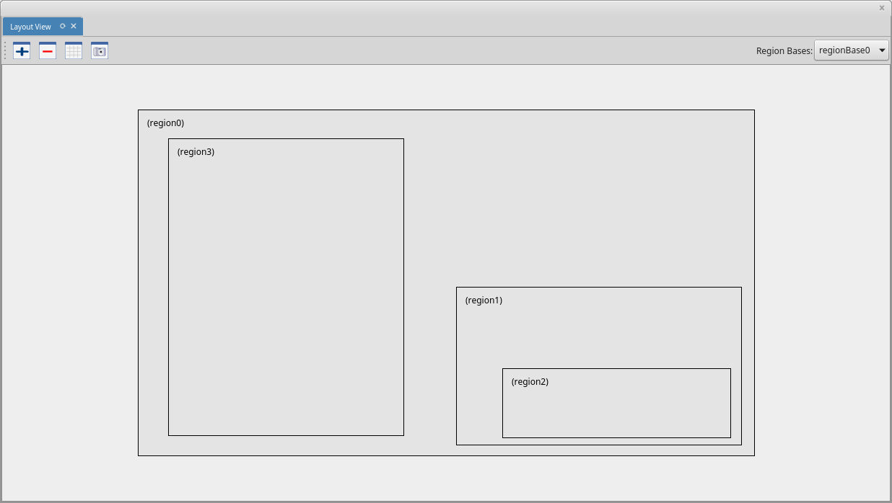

# Telas e Menus do {nclcomposer} #

## Janela Principal ##

### Barra de título ###
Evidencia o nome do {nclcomposer} e do projeto corrente.

### Barra de menu ###
Mostra as entradas de menu disponíveis.

### Barra de ferramentas ###
As ações globais ficam disponíveis na barra de ferramentas. Por exemplo, as
açoes para salvar o projeto atual, executá-lo etc.

### Tab Bar ###
Lista a tela de boas-vindas e a lista de projetos abertos, permitindo navegar
entre eles.

### Área das Visões ###
Área de desenho das diversas <<def:views, Visões>>. Cada visão pode ter
seus próprios elementos de interface. Também é possível organizar e salvar a
disposição das diversas visões por meio das <<def:perspective, Perspectivas>>.

## {structural_view} ##

*Versão: 0.3.0*

A {structural_view} permite que os autores de aplicações interajam visualmente
com a estrutura lógica do documento NCL. Em NCL, a estrutura lógica é
representada pelos seus objetos (nós de conteúdo e nós de composição) e os
elos entre esses objetos (representadas pelos elementos <link>).

#### Ações ####

As ações são as diversas atividades que o usuário pode realizar durante o
processo de autoria. Uma ação pode ser executada de várias formas: através da
barra de ferramenta, do menu contextual, de um atalho de teclado, do *mouse* e
da combinação de várias dessas formas. Abaixo são descritas cada uma das ações
disponíveis na {structural_view} e como elas podem ser executadas.

##### Desfazer #####

Desfaz a última ação realizada na visão. Esta ação é ignorada caso não exista
nenhuma ação para ser defeita. *Inserir*, *remover*, *mover* e *redimencionar*
são exemplos de ações que podem ser desfeitas. Por outro lado, selecionar não é
uma ação que pode ser desfeita. Na versão atual, não existe um limite na
quantidade de ações que podem ser desfeitas.

Esta ação pode ser executada através da: [barra de
ferramentas](#barra-de-ferramentas), [menu contextual](#menus) e
[atalho](#atalhos).

##### Resfazer #####

Refaz a última ação reallizada na visão. Esta ação é ignorada caso não exista
nenhuma ação para ser refeita, ou seja, nenhuma ação foi desfeita
anteriormente. Na versão atual, não existe um limite na quantidade de ações que
podem ser desfeitas.

Esta ação pode ser executada através da: [barra de
ferramentas](#barra-de-ferramentas), [menu contextual](#menus) e
[atalho](#atalhos).

##### Recortar #####

Copia a entidade selecionada para a **área de trânsferencia** e **remove** ela
da visão. Esta ação é ignorada caso nenhuma entidade tenha sido selecionada e
se a entidade selecionada é do tipo *body*.

Esta ação pode ser executada através da: [barra de
ferramentas](#barra-de-ferramentas), [menu contextual](#menus) e
[atalho](#atalhos).

##### Copiar #####

Copia a entidade selecionada para a **área de trânsferencia**. Esta ação é
ignorada caso nenhuma entidade tenha sido selecionada e se a entidade
selecionada é do tipo *body*.

Esta ação pode ser executada através da: [barra de
ferramentas](#barra-de-ferramentas), [menu contextual](#menus) e
[atalho](#atalhos).

##### Colar #####

Adiciona a entidade copiada para *área de trânsferencia* como filha da entidade
selecionada. Esta ação é ignorada caso nenhuma entidade tenha sido recortada ou
copiada e se a entidade selecionada não permita que seja adicionado como um de
seus filhos entidades do tipo selecionada. Por exemplo, não é possível colar um
contexto em uma mídia.

> Caso uma entidade tenha sido **copiada** (e não recortada) previamente, ao
> executar a ação de **colar**, uma [caixa de diálogo](#referência) será
> apresentada ao usuário permitindo a criação de uma **referência** ao invês de
> uma cópia. Caso o usuário escolha criar uma cópia, a ação executada será a de
> colar, descrita anteriormente. Porém, caso o usuário prefira criar uma
> referência, uma entidade será adicionada fazendo referência à entidade
> previamente copiada. Detalhes sobre a [referência de entidades](#referência)
> será tratado mais a frente. 

Esta ação pode ser executada através da: [barra de
ferramentas](#barra-de-ferramentas), [menu contextual](#menus) e
[atalho](#atalhos).

##### Deletar #####

Remove a entidade selecionada da visão. Esta ação é ignorada caso nenhuma
entidade esteja selecionada na visão.

Esta ação pode ser executada através do: [menu contextual](#menus) e
[atalho](#atalhos).

##### Mover #####

Move a entidade selecionada para uma entidade de destino. Para a
{structural_view}, mover significa alterar o parêntesco da entidade
selecionada. A entidade de destino é determinada manipulando a entidade
selecionada por meio de *drag-n-drop* para o interior da entidade de destino.
Esta ação é ignorada caso a entidade de destino não permita que seja adicionado
como um de seus filhos entidades do tipo selecionado.

> O *drag-n-drop* de uma entidade é realizado em 4 (quatro) passos: **i)**
> segurar a tecla Ctrl, **ii)** clicar com o botão esquerdo do *mouse* em uma
> entidade, **iii)** arrastar o *mouse* até entidade de destino e **iv)**
> soltar o botão do *mouse*. 

Esta ação pode ser executada através de [atalho](#atalhos).

##### Aumentar Zoom #####

Aumenta o *Zoom* na visão. Esta ação é ignorada caso a visão tenha alcançado
seu *Zoom* máximo.

Esta ação pode ser executada através da: [barra de
ferramentas](#barra-de-ferramentas) e [atalho](#atalhos).

##### Diminuir Zoom #####

Diminue o *Zoom* na visão. Esta ação é ignorada caso a visão tenha alcançado
seu *Zoom* mínimo.

Esta ação pode ser executada através da: [barra de
ferramentas](#barra-de-ferramentas) e [atalho](#atalhos).

##### Tirar uma Foto #####

Exporta o projeto como imagem (.png). O projeto pode ser exportado mesmo que
nenhuma entidade tenha sido adicionada.

Esta ação pode ser executada através da: [barra de
ferramentas](#barra-de-ferramentas) e [menu contextual](#menus).

##### Habilitar Ferramenta de Ponteiro #####

Altera o modo de edição da {structural_view} para "ponteiro". Quando no modo de
"ponteiro", a {structural_view} permite selecionar, mover e redimencionar as
entidades da através do *mouse*. O modo de "ponteiro" é desabilitado sempre o
modo de  *"link"* é habilitado.

Esta ação pode ser executada através da: [barra de
ferramentas](#barra-de-ferramentas) e [atalho](#atalhos).

##### Habilitar Ferramenta de Link #####

Altera o modo de edição da {structural_view} para *"link"*. Quando no modo de
*"link"*, a {structural_view} permite criar *links* (relacionamentos) entre
duas entidades. Para criar um novo *link*, o usuário deve: **i)** clicar com o
botão esquerdo do *mouse* na entidade de origem, **ii)** arrastar o *mouse* até
a entidade de destino e, em seguida, **iii)** soltar o botão esquerdo do
*mouse*. O modo de *"link"* é desabilitado sempre o modo de  "ponteiro" é
habilitado.

> Caso seja permitido criar um relaciomaneto entre as entidades de origem e
> destino, uma caixa de diálogo será apresentada para finalizar o processo de
> criação de *link*. Caso contrário, a ação é ignorada. Detalhes sobre o
> [diálogo de criação](#links) de *link* será discutido mais a frente. 

Esta ação pode ser executada através da: [barra de
ferramentas](#barra-de-ferramentas) e [atalho](#atalhos).

##### Criar uma Mídia #####

Adiciona uma entidade do tipo mídia como filha da entidade selecionada. Esta
ação é ignorada caso a entidade selecionada não permita que seja adicionada
como um de seus filhos entidades do tipo mídia.

Esta ação pode ser executada através da: [barra de
ferramentas](#barra-de-ferramentas), [menu contextual](#menus) e
[atalho](#atalhos).

##### Criar uma Contexto #####

Adiciona uma entidade do tipo contexto como filha da entidade selecionada. Esta
ação é ignorada caso a entidade selecionada não permita que seja adicionada
como um de seus filhos entidades do tipo contexto.

Esta ação pode ser executada através da: [barra de
ferramentas](#barra-de-ferramentas), [menu contextual](#menus) e
[atalho](#atalhos).

##### Criar um *Switch* #####

Adiciona uma entidade do tipo *switch* como filha da entidade selecionada. Esta
ação é ignorada caso a entidade selecionada não permita que seja adicionada
como um de seus filhos entidades do tipo *switch*.

Esta ação pode ser executada através da: [barra de
ferramentas](#barra-de-ferramentas), [menu contextual](#menus) e
[atalho](#atalhos).

##### Criar um *Body* #####

Adiciona uma entidade do tipo *body* na visão. Esta ação é ignorada caso um
*body* já tenha sido adicionado previamente.

Esta ação pode ser executada através da: [barra de
ferramentas](#barra-de-ferramentas), [menu contextual](#menus) e
[atalho](#atalhos).

##### Criar uma Área #####

Adiciona uma entidade do tipo área como filha da entidade selecionada. Esta
ação é ignorada caso a entidade selecionada não permita que seja adicionada
como um de seus filhos entidades do tipo área.

Esta ação pode ser executada através da: [barra de
ferramentas](#barra-de-ferramentas), [menu contextual](#menus) e
[atalho](#atalhos).

##### Criar uma Propriedade #####

Adiciona uma entidade do tipo propriedade como filha da entidade selecionada.
Esta ação é ignorada caso a entidade selecionada não permita que seja
adicionada como um de seus filhos entidades do tipo propriedade.

Esta ação pode ser executada através da: [barra de
ferramentas](#barra-de-ferramentas), [menu contextual](#menus) e
[atalho](#atalhos).

##### Criar uma Porta #####

Adiciona uma entidade do tipo porta como filha da entidade selecionada. Esta
ação é ignorada caso a entidade selecionada não permita que seja adicionada
como um de seus filhos entidades do tipo porta.

Esta ação pode ser executada através da: [barra de
ferramentas](#barra-de-ferramentas), [menu contextual](#menus) e
[atalho](#atalhos).

##### Criar uma Porta de *Switch* #####

Adiciona uma entidade do tipo porta de *switch* como filha da entidade
selecionada. Esta ação é ignorada caso a entidade selecionada não permita que
seja adicionada como um de seus filhos entidades do tipo porta de *switch*.

Esta ação pode ser executada através da: [barra de
ferramentas](#barra-de-ferramentas), [menu contextual](#menus) e
[atalho](#atalhos).

##### Habilitar/Desabilitar Minimapa #####

Habilita/Desabilita o minimapa. Quando habilitado, o minimapa é exibido no
canto inferior direito da visão.

Esta ação pode ser executada através da: [barra de
ferramentas](#barra-de-ferramentas) e [atalho](#atalhos).

#### Barra de Ferramentas ####

A partir da versão 0.3.0 a {structural_view} disponibiliza uma *barra de
ferramentas* para facilitar o processo de autoria. 

A figura acima apresenta a *barra de ferramentas*, cujo detalhes de cada
ferramenta são descritos a seguir:

- **(a) - Desfazer:** Desfaz a última ação realizada na visão. [Mais
                      detalhes](#ações).
- **(b) - Refazer:** Refaz a última ação reallizada na visão. [Mais
                     detalhes](#ações).
- **(c) - Recortar:** Copia a entidade selecionada para a **área de
		      trânsferencia** e **remove** ela da visão. [Mais
                      detalhes](#ações).
- **(d) - Copiar:** Copia a entidade selecionada para a **área de
                    trânsferencia**. [Mais detalhes](#ações).
- **(e) - Colar:** Adiciona a entidade copiada para *área de trânsferencia*
                   como filha da entidade selecionada. [Mais detalhes](#ações).
- **(f) - Aumentar o *Zoom:*** Aumenta o *Zoom* na visão. [Mais
                               detalhes](#ações).
- **(g) - Diminuir o *Zoom:*** Diminue o *Zoom* na visão. [Mais
                               detalhes](#ações).
- **(h) - Tirar uma Foto:** Exporta o projeto como imagem (.png). [Mais
                            detalhes](#ações).
- **(i) - Ferramenta de Ponteiro:** Altera o modo de edição da visão para
                                    "ponteiro". [Mais detalhes](#ações).
- **(j) - Ferramenta de *Link*:** Altera o modo de edição da visão para "link".
                                  [Mais detalhes](#ações).
- **(k) - Adicionar Mídia:** Adiciona uma entidade do tipo mídia como filha da
                             entidade selecionada. [Mais detalhes](#ações).
- **(l) - Adicionar Contexto:** Adiciona uma entidade do tipo context como
				filha da entidade selecionada. [Mais
                                detalhes](#ações).
- **(m) - Adicionar *Switch*:** Adiciona uma entidade do tipo *switch* como
				filha da entidade selecionada. [Mais
                                detalhes](#ações).
- **(n) - Adicionar *Body*:** Adiciona um *body* na visão. [Mais
                              detalhes](#ações).
- **(o) - Adicionar Área:** Adiciona uma entidade do tipo área como filha da
                            entidade selecionada. [Mais detalhes](#ações).
- **(p) - Adicionar Propriedade:** Adiciona uma entidade do tipo propriedade
				   como filha da entidade selecionada. [Mais
                                   detalhes](#ações).
- **(q) - Adicionar Porta:** Adiciona uma entidade do tipo porta como filha da
                             entidade selecionada. [Mais detalhes](#ações).
- **(r) - Adicionar Porta de *Switch*:** Adiciona uma entidade do tipo porta de
					 *switch* como filha da entidade
					 selecionada. [Mais detalhes](#ações).

### Menus

##### Menu Contextual #####

O menu contextual é exibido sempre que o usuário clica com o botão direito do
*mouse* em qualquer entidade ou nas áreas vazias (em branco) da visão. 

A figura acima apresenta o *menu contextual*, cujo detalhes são descritos
abaixo:

- **(a) - Exibir Ajuda:** Exibe o diálogo de ajuda. *Desabilitado nesta
                          versão*.
- **(b) - Insert:** Exibe o submenu de adção de entidades.
- **(c) - Desfazer:** Desfaz a última ação realizada na visão. [Mais
                      detalhes](#ações).
- **(d) - Refazer:** Refaz a última ação reallizada na visão. [Mais
                     detalhes](#ações).
- **(e) - Recortar:** Copia a entidade selecionada para a **área de
		      trânsferencia** e **remove** ela da visão. [Mais
                      detalhes](#ações).
- **(f) - Copiar:** Copia a entidade selecionada para a **área de
                    trânsferencia**. [Mais detalhes](#ações).
- **(g) - Colar:** Adiciona a entidade copiada para *área de trânsferencia*
		   como filha da entidade selecionada. [Mais detalhes](#ações).
- **(h) - Deletar:** Remove a entidade selecionada da visão. [Mais
                     detalhes](#ações).
- **(i) - Tirar uma Foto:** Exporta o projeto como imagem (.png). [Mais
                            detalhes](#ações).
- **(j) - Exibir Propriedades:** Exibe o diálogo de propriedades. *Desabilitado
                                 nesta versão*
- **(k) - Adicionar Mídia:** Adiciona uma entidade do tipo mídia como filha da
                             entidade selecionada. [Mais detalhes](#ações).
- **(l) - Adicionar Contexto:** Adiciona uma entidade do tipo context como
				filha da entidade selecionada. [Mais
                                detalhes](#ações).
- **(m) - Adicionar *Switch*:** Adiciona uma entidade do tipo *switch* como
				filha da entidade selecionada. [Mais
                                detalhes](#ações).
- **(n) - Adicionar *Body*:** Adiciona um *body* na visão. [Mais
                              detalhes](#ações).
- **(o) - Adicionar Área:** Adiciona uma entidade do tipo área como filha da
                            entidade selecionada. [Mais detalhes](#ações).
- **(p) - Adicionar Propriedade:** Adiciona uma entidade do tipo propriedade
				   como filha da entidade selecionada. [Mais
                                   detalhes](#ações).
- **(q) - Adicionar Porta:** Adiciona uma entidade do tipo porta como filha da
                             entidade selecionada. [Mais detalhes](#ações).
- **(r) - Adicionar Porta de *Switch*:** Adiciona uma entidade do tipo porta de
					 *switch* como filha da entidade
                                         selecionada. [Mais detalhes](#ações).

#### Diálogos ####

##### Diálogo de Link #####

O diálogo de *link* é utilizado para criação e edição de: *links*, *binds*,
parâmetros de *link* e parâmetros de *binds*. O diálogo para criação de *link*
é exibido quando um relacionamento entre uma entidade de origem e destino é
especificado através da [ferramenta de criação de *link*](#ações). 

Logo que exibido (figura abaixo), o diálogo de *link* apresenta uma lista de
conectores para que o usuário possa escolher. A lista de conectores é carregada
dinâmicamente a partir das especificações da aplicação em desenvolvimento.

Assim que o usuário começar a preencher a caixa de texto *"connector"* (figura
abaixo), a lista de conectores é filtrada para facilitar a seleção do conector
apropriado.

Uma vez selecionado um dos conectores na lista, o usuário pode escolher qual o
tipo de condição e ação na seção de *binds* do diálogo (figura abaixo). Os
tipos de condições e ações disponíveis são carregados a patir do conector
selecionado. 

Ainda na criação do *link*, quando o usuário habilita a exibição de parâmetros
(*"show params"*), é possível especificar os valores dos parâmetros de *link*,
parâmetros do *bind* de condição e parâmetros do *bind* de ação (figura abaixo)
que devem ser considerados para criação do relacionamento.

Para editar os parâmetros de um *link*, o usuário deve clicar duas vezes na
entidade do tipo *link* na visão. Esta ação resultana exibição do diálogo
abaixo.

De modo semelhante, para editar um *bind*, o usuário deve clicar duas vezes na
entidade do tipo *bind*, resultando na exibição do diálogo abaixo.

")

##### Referência #####

É possível especificar uma referência através da ação de [colar](#ações). Assim
que a ação de colar é realizada o diálogo abaixo é exibido, solicitando que o
autor escolha entre copiar ou criar uma referência da entidade copiada para
*área de tranferência*.

Quando uma entidade é uma referência, ela fica levemente transparente (figura
abaixo) e herda todas as interfaces da entidade referenciada. Não é possível
referenciar uma entidade que já referencia uma outra. Nesta versão ainda não é
possível fazer referência para entidades do tipo: contexto, *switch* e *body*.

#### Atalhos ####

Abaixo segua a lista de atalhos da {structural_view}:

- **Desfazer (Ctrl+z):** Desfaz a última ação realizada na visão. [Mais
  detalhes](#ações).
- **Refazer (Ctrl+Shift+z):** Refaz a última ação reallizada na visão. [Mais
  detalhes](#ações).
- **Recortar (Ctrl+x):** Copia a entidade selecionada para a **área de
  trânsferencia** e **remove** ela da visão. [Mais detalhes](#ações).
- **Copiar (Ctrl+c):** Copia a entidade selecionada para a **área de
  trânsferencia**. [Mais detalhes](#ações).
- **Colar (Ctrl+v):** Adiciona a entidade da *área de trânsferencia* como filha
  da entidade selecionada. [Mais detalhes](#ações).
- **Deletar (Del):** Remove a entidade selecionada da visão. [Mais
  detalhes](#ações).
- **Mover (Ctrl+Drag-n-Drop):** Remove a entidade selecionada da visão. [Mais
  detalhes](#ações).
- **Aumentar o *Zoom* (Ctrl++ OU Ctrl+Roda do *mouse* para cima):** Aumenta o
  *Zoom* na visão. [Mais detalhes](#ações).
- **Diminuir o *Zoom* (Ctrl+- OU Ctrl+Roda do *mouse* para baixo):** Diminue o
  *Zoom* na visão. [Mais detalhes](#ações).
- **Ferramenta de Ponteiro (1):** Altera o modo de edição da visão para
  "ponteiro". [Mais detalhes](#ações).
- **Ferramenta de *Link* (2 OU Segurar Shift):** Altera o modo de edição da
  visão para "link". [Mais detalhes](#ações).
- **Adicionar Mídia (3):** Adiciona uma entidade do tipo mídia como filha da
  entidade selecionada. [Mais detalhes](#ações).
- **Adicionar Contexto (4):** Adiciona uma entidade do tipo context como filha
  da entidade selecionada. [Mais detalhes](#ações).
- **Adicionar *Switch* (5):** Adiciona uma entidade do tipo *switch* como filha
  da entidade selecionada. [Mais detalhes](#ações).
- **Adicionar *Body* (6):** Adiciona um *body* na visão. [Mais
  detalhes](#ações).
- **Adicionar Área (7):** Adiciona uma entidade do tipo área como filha da
  entidade selecionada. [Mais detalhes](#ações).
- **Adicionar Propriedade (8):** Adiciona uma entidade do tipo propriedade como
  filha da entidade selecionada. [Mais detalhes](#ações).
- **Adicionar Porta (9):** Adiciona uma entidade do tipo porta como filha da
  entidade selecionada. [Mais detalhes](#ações).
- **Adicionar Porta de *Switch* (0):** Adiciona uma entidade do tipo porta de
  *switch* como filha da entidade selecionada. [Mais detalhes](#ações).
- **Habilitar/Desabilitar Minimapa (Ctrl+M):** Habilita/Desabilita o minimapa.
  [Mais detalhes](#ações).

#### Outros detalhes ####

Todo plugins do {nclcomposer} permite sincronizar (ou resincronizar) o estado
atual da visão com o modelo do núcleo da ferramenta. Esta tarefa é realiza
através de um botão na aba de cada visão. No caso da {structural_view}, sempre
que a visão é resincronizada com o modelo do núcleo da ferramenta, todo o
histório de ações é perdido, de modo que não é possível desfazer ou refazer uma
ação.

## {layout_view} ##

A {layout_view} permite que os autores de aplicações NCL interajam visualmente
com as regiões onde os objetos de mídia serão inicialmente apresentados. Nesta
visão, os autores podem criar e manipular as regiões e a hierarquia de regiões
do documento.

## {outline_view} ##

A {outline_view} apresenta a estrutura do documento NCL como uma árvore,
permitindo aos autores navegarem no documento.

## {properties_view} ##

A {properties_view} apresenta o conjunto de propriedades da entidade
selecionada. Essa entidade selecionada por ser, por exemplo, uma região na
{layout_view}, um objeto de mídia na {structural_view} etc.

## {textual_view} ##

A _{textual_view}__ permite aos usuários interagirem diretamente com o
código-fonte da aplicação NCL. Ela é um editor de texto avançado focado na
linguagem NCL e traz funcionalidades como: coloração sintática, sugestão de
código contextual e formatação de código.

A _{textual_view}_ é recomendada especialmente para usuários avançados e que se
sentem à vontade com a sintaxe XML.

## {rules_view} ##

TODO	

## {validator} ##

O validador é responsável por notificar erros e alertas no documento NCL.
A figura a seguir apresenta um exemplo.

## {run_view} ##

TODO

