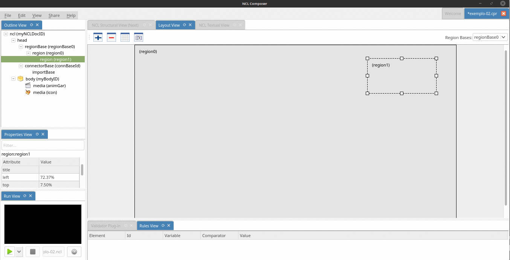

# Exemplo 02: Reproduzindo um vídeo e uma imagem

## Objetivo
O objetivo deste exemplo é apresentar um vídeo e uma imagem na tela.

## Passo 1: Adicionando os objetos de mídia  (**O que?**)
Neste exemplo, queremos uma aplicação com dois objetos de mídia (um vídeo e uma
imagem).  Para inserí-los no seu projeto, basta arrastar as duas mídias do seu
gerenciador de arquivos para a {structural_view} do {nclcomposer}.

> Caso precise de mais informações sobre como criar um novo projeto veja o
> [__Passo 0__ do Exemplo 01](01.hello_world).

## Passo 2: Onde os objetos de mídia serão apresentados
Agora temos que definir __onde__ os objetos de mídia serão apresentados.  Para
isso, vamos para a {layout_view}.

### Criando regiões

Como podemos perceber, por padrão, o {nclcomposer} já cria uma região
``region0`` que ocupa toda a tela.  Iremos reusar essa região para o vídeo
(queremos que ele toque em toda a tela) e iremos criar uma nova região para a
imagem.  Para isso, podemos clicar com o botão direito do mouse na região
existente e acessar a opção ``Add region`` do menu contextual.

Com a região criada, podemos agora redimensioná-la e posicioná-la da melhor
forma que quisermos.

### Associando as mídias as regiões

Depois de criarmos as regiões, agora queremos associar cada uma das mídias (o
vídeo e a imagem), a cada uma das suas regiões.  Para isso, basta arrastar a
mídia da {outline_view} para a respectiva região na {layout_view}.

## Passo 3: Quando os objetos de mídia serão apresentados

Como os dois objetos de mídia iniciarão no começo da aplicação, uma forma
simples de definir esse comportamento é criando-se uma porta para cada um
desses objetos.

Diferente de objetos de mídia de vídeo e áudio, objetos de mídia
estáticos---como, por exemplo, imagens---não possuem duração implícíta.  Neste
caso, caso iniciemos sua execução ela sendo apresentada indefinidamente.  Para
definirmos a duração de uma mídia (por exemplo, uma imagem) de forma explícita
podemos o atributo ``explicitDur`` no descritor associado à esta mídia (veja a
animação abaixo, onde definimos que a imagem irá durar ``5s``).

## Passo 4: Executando o exemplo
Feito isso, o nosso exemplo já está completo e podemos executá-lo na
{run_view}.

