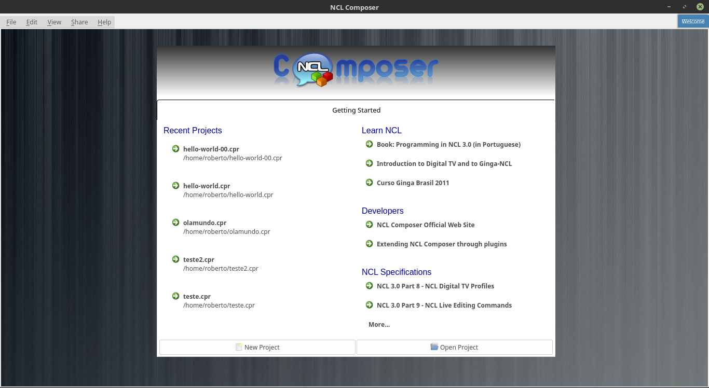
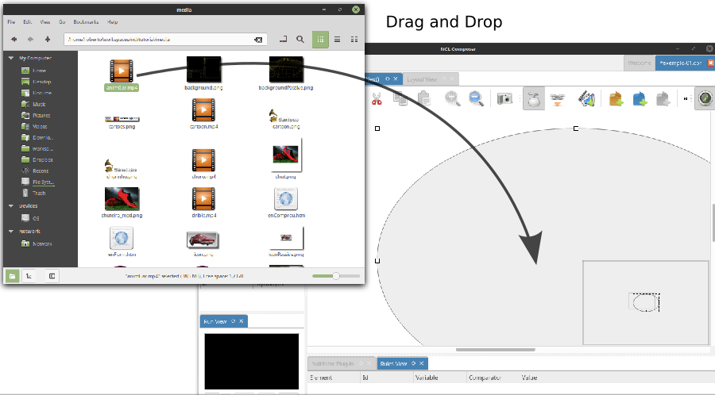
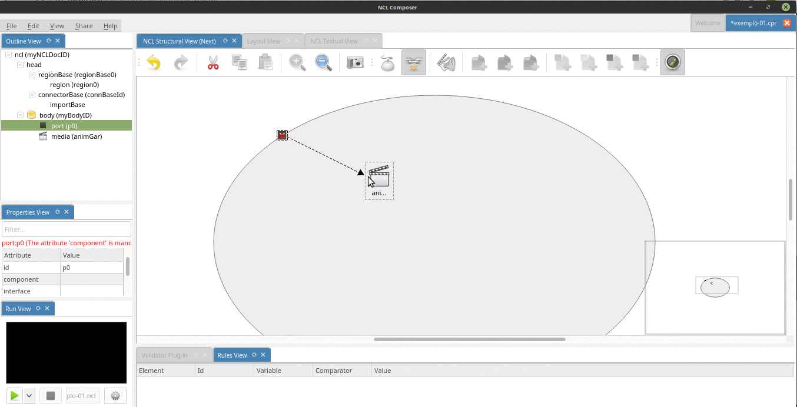
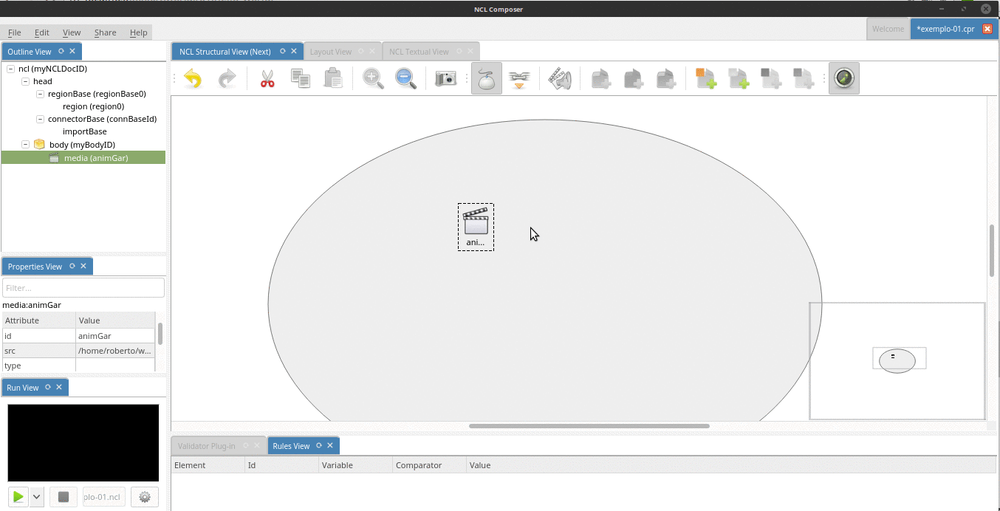

.. include:: ../dict.rst

Exemplo 01: Reproduzindo um objeto de mídia
===========================================

Objetivo
--------

Neste primeiro exemplo, o objetivo é apenas exibir um objeto de mídia,
em tela cheia.

Para isso, iremos:

1. Criar um novo projeto;
2. Adicionar o objeto de mídia (no exemplo, usaremos um vídeo) na
   aplicação;
3. Informar que esse objeto será iniciado quando a aplicação começar, e
4. Determinar a região da tela onde esse objeto de mídia será exibido.

Passo 0: Criando um novo projeto
--------------------------------

Para criarmos o nosso exemplo, o primeiro passo é criarmos um novo
projeto.

Ao abrir o |nclcomposer|, a seguinte tela de boas-vindas é apresentada:

   Tela de boas-vindas do |nclcomposer|.

Nessa tela, é possível criar um novo projeto por meio do menu
*File-&gt;New Project*, por meio do botão *New Project* no canto
esquerdo inferior da tela de boas-vindas, ou simplesmente pressionando
*Ctrl+N*.

Feito isso, a seguinte janela será exibida:

.. figure:: ../../img/nclcomposer-exemplo-01-newproject.png
   :width: 60%
   :align: center

   Criação de um novo projeto.

Atribua um nome para o projeto que você está criando (aqui atribuímos o
nome *exemplo-01*), selecione o diretório onde deseja salvá-lo e deixe
as opções *Copy and Import the default Connector Base* (Copie e importe
a base de conectores padrão) e *Add a default region to the project*
(adicione uma região padrão ao projeto) selecionadas.

.. note::
  Nas próximas seções serão discutidos em detalhes o que são os conectores
  e bases de conectores. Por enquanto, apenas deixe esta opção marcada, pois
  ela será útil para os próximos exemplos.

Por fim, pressione o botão *Finish*, e o seu novo projeto será criado e
aberto.

A animação a seguir exemplifica a criação de um projeto.

.. figure:: ../../img-anim/ex01-step00-new-project.gif
   :align: center

   Criando um novo projeto.

Ao criar o novo projeto, o |nclcomposer| irá automaticamente abrí-lo,
onde teremos acesso às visões: |default_views|.

Passo 1: Adicionando um objeto de mídia (**O que?**)
----------------------------------------------------

Com o nosso projeto criado e aberto, podemos começar a desenvolver a
nossa aplicação. Como primeiro passo, temos que adicionar o objeto de
mídia da nossa aplicação (neste primeiro exemplo, teremos apenas um
objeto de mídia, um vídeo).

Para inserir os objetos de mídia (áudio, vídeo, imagens etc.) em nossa
aplicação, a forma mais simples é apenas arrastá-los do seu gerenciador
de arquivos para dentro da |structural_view| do |nclcomposer|.

   Arraste o objeto de mídia do seu gerenciador de arquivos para a 
   |structural_view| do |nclcomposer| para inserí-lo como objetos de mídia
   da aplicação

.. note::

   Outra forma de inserir um objeto de mídia, na |structural\_view| é clicar com
   o botão direito sobre o corpo do documento e selecionar o menu *Insert ->
   Media*. Neste caso, é importante não esquecer de definir o caminho para o
   objeto de mídia, o que poder ser realizado selecionando o objeto que você
   acabou de editar e alterando o valor do atributo *src* (ou na *Visão de
   Propriedades* ou na *Visão Textual*).

A animação a seguir, exemplica como podemos adicionar um novo objeto de
mídia, arrastando a partir do gerenciador de arquivos.

.. figure:: ../../img-anim/ex01-step01-insert-media.gif
   :align: center

Passo 2: Informando o objeto de mídia que serão inicialmente exibidos (**Quando?**)
-----------------------------------------------------------------------------------

Para informar que o objeto de mídia que acabamos de inserir deve iniciar
quanto a nossa aplicação iniciar, é suficiente criarmos uma **porta** no
corpo do documento, mapeando-a para o objeto de mídia. As portas de um
contexto (inclusive do corpo do documento, que nada mais é do que o
contexto inicial do documento) definem quais os objetos daquele contexto
serão iniciados quando aquele contexto for iniciado.

Para inserirmos uma porta no corpo do documento pela *Visão Estrutural*
é suficiente clicarmos com o botão direito sobre o corpo e selecionarmos
o menu *Insert->Port*.

.. figure:: ../../img/ex01-step02-insert-port.png
   :align: center

Para mapearmos a porta que acabamos de criar para o objeto de mídia,
podemos selecionar a ferramenta *Link* na barra de tarefas e clicar
sobre a porta e, mantendo o botão do mouse pressionado, arrastar o
ponteiro até o objeto de mídia.

.. note::
  Outra forma de ativar a ferramenta *Link* é segurando a tecla SHIFT
  enquanto faz-se o mesmo procedimento acima.

   Mapeando porta para objeto de mídia.

Com isso, já definimos que nossa aplicação é constituída apenas de um
objeto de mídia e que quando a aplicação começar, esse objeto de mídia
será executado.

A animação a seguir exemplica como criar e mapear uma porta no corpo do
documento.

   Mapeando porta para objeto de mídia.

Passo 3: Definindo a região onde o objeto de mídia será apresentado (**Onde?**)
-------------------------------------------------------------------------------

Para finalizar este primeiro exemplo só falta agora definirmos **onde**
(em que região da tela) o objeto de mídia da nossa aplicação será
exibido.

Como ao criarmos o nosso projeto, deixamos a opção *"Add a default
region to the project"* selecionada, ao criarmos o projeto já criamos
também uma região que ocupa toda a tela.

Para associarmos a mídia que adicionamos no nosso projeto à essa região,
basta arrastamos essa mídia (por exemplo, a partir da **visão de
outline**) para a região na visão de leiaute. Veja a animação a seguir:

.. figure:: ../../img-anim/ex01-step03-media-to-region.gif
   :align: center

   Associando uma media à uma região.

Ao fazermos isso, o |nclcomposer| irá nos perguntar se queremos "copiar
os dados da região" para a mídia ou se queremos criar um descritor. Um
descritor serve para podermos reusar as mesmas propriedades em mais de
uma mídia. Exemplos destas propriedade são o posicionamento e a largura
e a altura do objeto de mídia. Na grande maioria das vezes (inclusive
aqui) iremos querer criar um descritor.

Passo 4: Executando o exemplo
-----------------------------

Feito isso, o nosso primeiro exemplo já está completo.

Para executá-lo, basta executar o projeto no botão "Run NCL Project"
 na *Run view*.

.. figure:: ../../img-anim/ex01-step04-run.gif
   :align: center

   Executando a aplicação.
